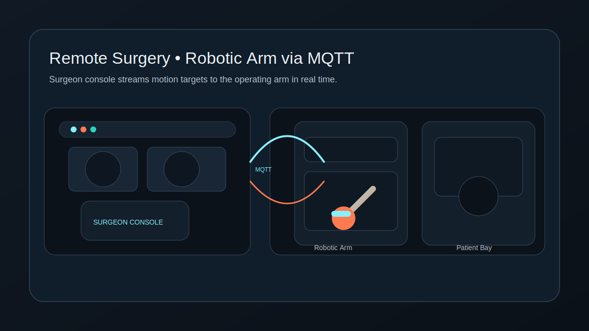
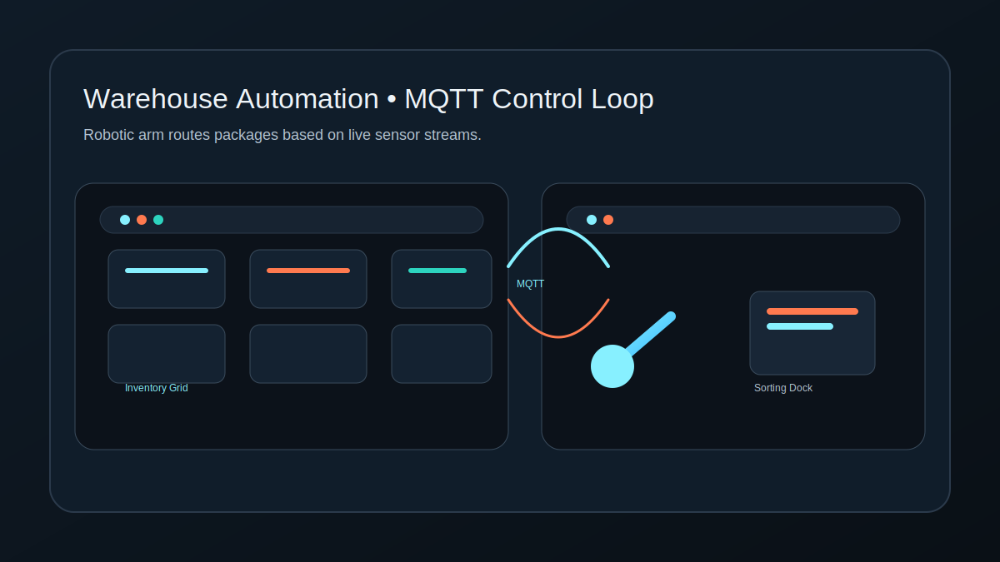
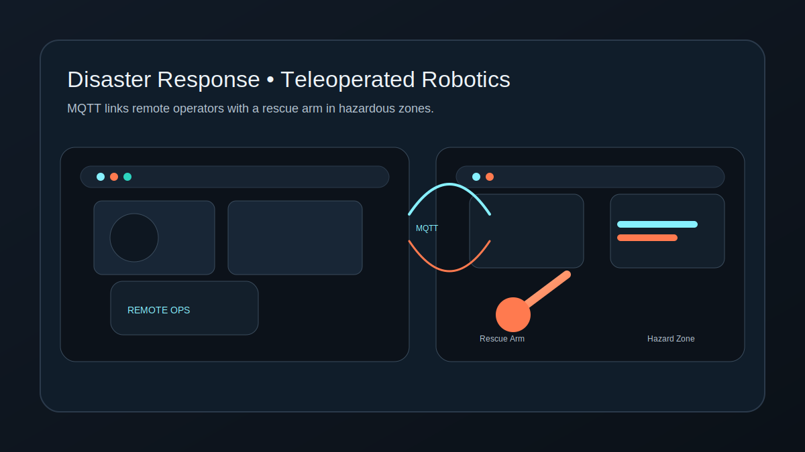

# Mirror Hand


Mechanical system that mirrors human hand motion in real time with a Python signal-processing core and MQTT messaging.

## Screenshot





## Run Locally

### Frontend
```
npm install
npm run dev
```
Then open `http://127.0.0.1:5173`.

### Backend
```
python -m venv .venv
.venv\Scripts\activate
pip install -r backend\requirements.txt
python backend\app.py
```
Defaults to MQTT broker at `localhost:1883`.

## Deployment (GitHub Pages)
This repo is configured to deploy the frontend automatically via GitHub Pages on every push to `main`.
